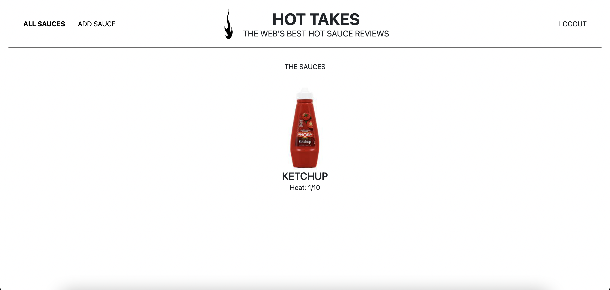
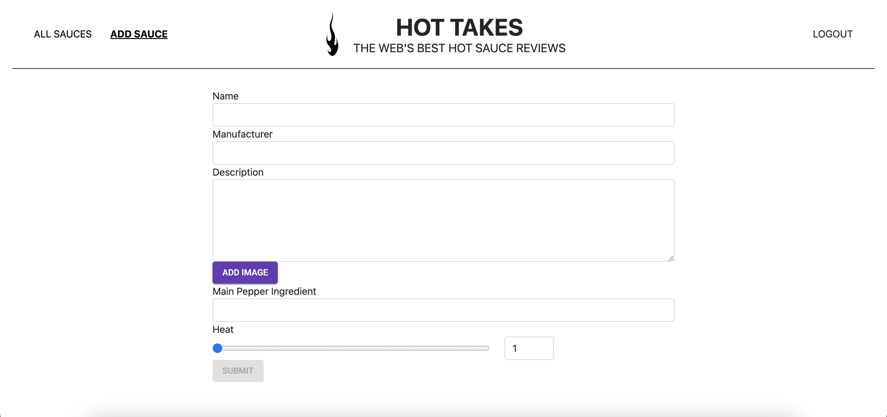
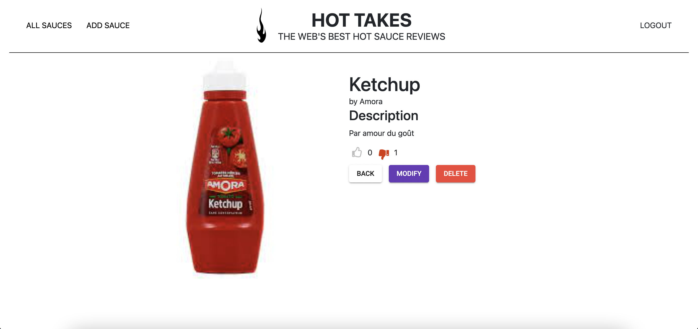

# Piquante 🌶🌵
## A project to learn back end and how to create a Rest API

This is my solution to the 6th project of the OpenClassroom's Web Developer course. In this challenge, you will learn how to create all the back end of a  Sauce review app. I've used Express JS and Mongo DB here.

## Overview

### The challenge

Your challenge is to build the API based on the documentation OpenClassroom gave you. You will need to hash the password and create verified routes..

Your users should be able to:

- Signup/Login 
- See all the sauce on the homepage
- Add a new sauce
- Modify a sauce
- Like or dislike a sauce 
- Delete a sauce

### Screenshot

### Built with

- Express JS
- Mongo DB

## Author

- Caroline Lienard (https://github.com/CarolineLienard)
- OpenClassrooms - (https://openclassrooms.com/fr/)
 
#### Note: If you are student, do your best to create your own solution, you got this 👍🏻
